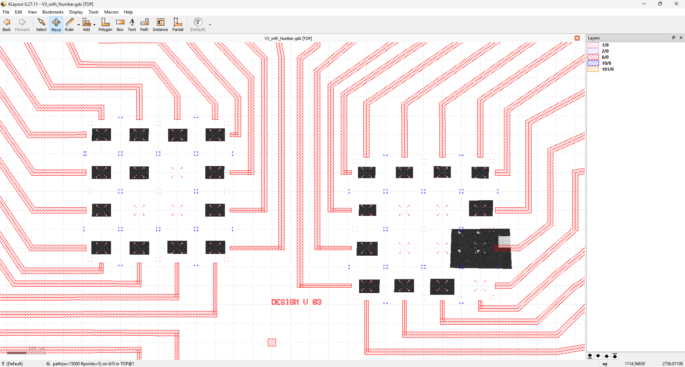
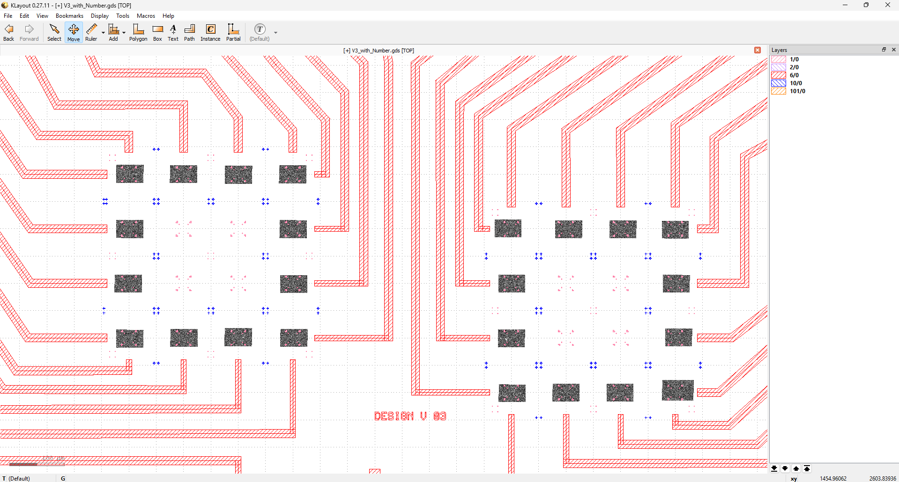
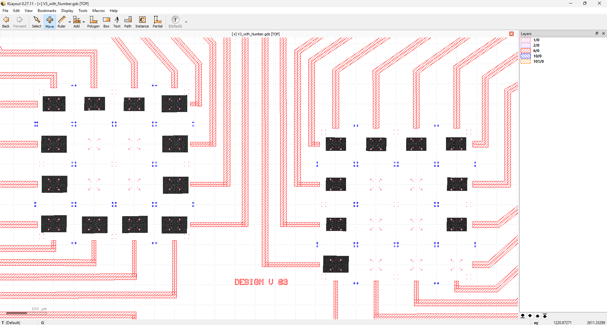

# landmark_detection
- DISCALAIMER: This is not the actual project repository, just a demonstration of my improvements, much of the full repository is not mine to distribute.
- Making use of Scikit-Image Template Matching functionality to determine landmark coordinates in SEM TIF images.
- For use in KLayout lithography mapping auto-align modules.
  
Results of First Testing Phase:

- 69/70 images were correctly placed by landmark location (minimal adjsutment required, greatly improved from initial pipeline).
- 1 image, which included a large portion of a bonding pad was not properly located.
- A systematic shift was observed in images (between the chip design and image placement, quick to fix within KLayout but should not happen consistently).

